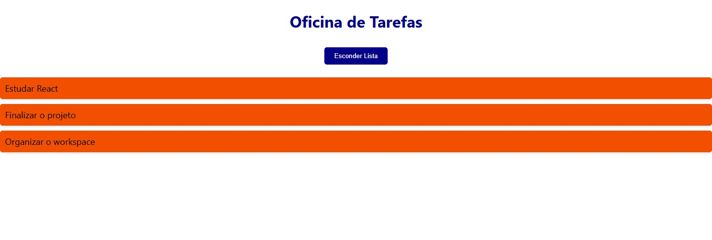
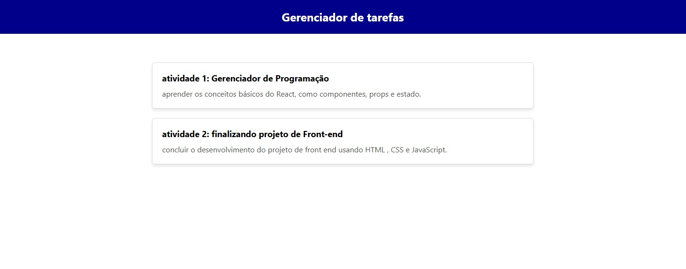

# Documentação do Projeto

- **Data de Execução:** 06/12/2024  
- **Aluno:** Alysson Rodrigo

---

# Oficina de Tarefas 

Este projeto é uma aplicação React desenvolvida para gerenciar tarefas de forma prática e visualmente atrativa.

## Funcionalidades

- Adicionada uma lista de tarefas com títulos mais descritivos para maior engajamento.
- Botão interativo para exibir ou ocultar a lista de tarefas:
  - Quando a lista está visível, o botão exibe "Esconder Lista".
  - Quando a lista está oculta, o botão exibe "Mostrar Lista".
- Estilização personalizada:
  - Cores, bordas arredondadas e sombras nos itens da lista para maior destaque.
  - Botão estilizado que altera sua cor dependendo do estado.

# Código Utilizado para Fazer o Botão

```javascript
import React, { useState } from "react";
import "./App.css";

function App() {
  
  const [tasks, setTasks] = useState([
    { id: 1, text: " Estudar React" },
    { id: 2, text: " Finalizar o projeto" },
    { id: 3, text: " Organizar o workspace" },
  ]);

  const [showList, setShowList] = useState(true);

  const toggleList = () => {
    setShowList(!showList);
  };

  return (
    <div className="App">
      <h1 style={{ color: "#00008B" }}> Oficina de Tarefas</h1>

      <button
        onClick={toggleList}
        style={{
          padding: "10px 20px",
          backgroundColor: showList ? "#00008B" : "#00008B",
          color: "white",
          border: "none",
          borderRadius: "5px",
          cursor: "pointer",
          margin: "10px 0",
        }}
      >
        {showList ? "Esconder Lista" : "Mostrar Lista"}
      </button>

      {showList && (
        <ul style={{ listStyleType: "none", padding: 0 }}>
          {tasks.map((task) => (
            <li
              key={task.id}
              style={{
                background: "#f24f00",
                padding: "10px",
                margin: "10px 0",
                borderRadius: "5px",
                boxShadow: "0 2px 5px rgba(0,0,0,0.1)",
                display: "flex",
                alignItems: "center",
                fontSize: "18px",
              }}
            >
              {task.text}
            </li>
          ))}
        </ul>
      )}
    </div>
  );
}

export default App;
  
```
# print do site 



---

# Configuração do Projeto com React

Passos Realizados
Criamos o componente Header para exibir o título "Gerenciador de Tarefas".
Desenvolvemos o componente TaskContainer para exibir uma lista de tarefas fictícias com título e descrição.
Atualizamos o arquivo App.js para importar e renderizar os componentes Header e TaskContainer.
Aplicamos estilização utilizando CSS inline diretamente nos componentes para um layout simples e funcional.

# Aula 16 - Criando um Gerenciador de Tarefas com React

Descrição das Alterações
Nesta aula, construímos um gerenciador de tarefas simples em React. As principais mudanças realizadas foram:

Criamos o componente Header, que exibe o título do aplicativo na parte superior.
Criamos o componente TaskContainer, que renderiza dinamicamente uma lista de tarefas fictícias.
Estilizamos os componentes com CSS inline, utilizando objetos JavaScript na propriedade style.

# Header.js

Descrição
O componente Header é responsável por exibir o título "Gerenciador de Tarefas" na parte superior do aplicativo.

Perguntas e Respostas
Quais os imports utilizados?
React: Importado para criar o componente funcional.

Há componentes? O que fazem?
Sim, o componente principal é o Header. Ele renderiza um título estilizado.

Como o estilo foi aplicado?
Usamos CSS inline, configurado diretamente no componente através de um objeto headerStyle.

# Bloco de Codigo

import React from 'react';

function Header() {
return (
    <header style={headerStyle}>
    <h1>Gerenciador de tarefas</h1>
    </header>
);
}

const headerStyle = {
backgroundColor: '#000080',
color: 'white',
textAlign: 'center',
padding: '10px',
};

export default Header;
---

# TaskContainer.js

Descrição
O TaskContainer é responsável por exibir uma lista de tarefas fictícias com título e descrição.

Perguntas e Respostas
Quais os imports utilizados?
React: Importado para criar o componente funcional.

Há componentes? O que fazem?
Sim, o componente TaskContainer renderiza dinamicamente as tarefas em uma lista estilizada.

Como as tarefas são exibidas?
Elas são definidas em um array de objetos e renderizadas dinamicamente usando o método .map().

Como o estilo foi aplicado?
Usamos CSS inline para estilizar as tarefas e o contêiner principal.

# Bloco De Cogido 

import React from 'react';

function TaskContainer() {
return (
    <div style={containerStyle}>
    <React.Fragment>
        <div style={taskStyle}>
        <h3>atividade 1:Gerenciador de Programação</h3>
        <p> aprender os conceitos básicos do React, como componentes , props e estado.</p>
        </div>
        <div style={taskStyle}>
        <h3>atividade 2:finalizando projeto de Front-end </h3>
        <p>Elaborar refeições compactas e nutritivas para os astronautas durante a viagem.</p>
        </div>
    </React.Fragment>
    </div>
);
}

// Estilos opcionais
const containerStyle = {
margin: '20px auto',
padding: '10px',
maxWidth: '600px',
backgroundColor: '#f4f4f4',
borderRadius: '8px',
};

const taskStyle = {
backgroundColor: '#fff',
padding: '10px',
margin: '10px 0',
border: '1px solid #ccc',
borderRadius: '4px',
};

export default TaskContainer;
---

# App.js

Descrição
O App.js é o ponto de entrada do aplicativo. Ele organiza e renderiza os componentes principais do projeto (Header e TaskContainer).

Perguntas e Respostas
Quais os imports utilizados?
React: Importado para criar o componente funcional.
Header, TaskContainer: Componentes personalizados, importados para renderização.

Como o layout foi configurado?
Os componentes Header e TaskContainer foram renderizados dentro de uma div principal.

# Bloco de codigo 

import React from 'react';
import Header from './components/Header';
import TaskContainer from './components/TaskContainer';

function App() {
  return (
    <div>
      <Header />
      <TaskContainer />
    </div>
  );
}

export default App;
--- 

# Site Funcionando 



---

# Estilização do Projeto

A estilização foi realizada por meio de CSS inline, o que significa que os estilos foram inseridos diretamente nos componentes React utilizando a propriedade style. Essa metodologia proporciona uma maneira prática e ágil de aplicar estilos, dispensando a necessidade de arquivos CSS separados. Cada componente possui seus próprios estilos, o que simplifica o código e facilita a sua compreensão. Contudo, apesar de o CSS inline funcionar bem em projetos menores, em projetos de maior envergadura, pode ser necessário implementar outras abordagens, como a utilização de arquivos CSS externos ou bibliotecas de estilização, para assegurar uma melhor organização e escalabilidade do código.
