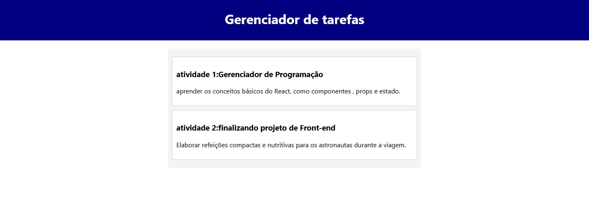

# Documentação do Projeto

- **Data de Execução:** 26/11/2024  
- **Aluno:** Alysson Rodrigo 

## Configuração do Projeto com Reactstrap

### Passos Realizados
1. Substituímos o uso do componente `Media` pelo `Card` no arquivo `MenuComponent.js`.
2. Adicionamos um arquivo `dishes.js` para centralizar as informações dos pratos, simulando uma base de dados.
3. Atualizamos o arquivo `App.js` para passar as informações dos pratos como *props* para o componente `Menu`.
4. Configuramos o CSS do Bootstrap para estilizar os componentes.

---

## Aula 10 - React Components

### Descrição das Alterações
Nesta aula, realizamos diversas alterações no projeto para implementar a exibição de um menu utilizando o componente `Card` do Reactstrap. As principais mudanças foram:

- Substituímos o uso do componente `Media` pelo `Card` no arquivo `MenuComponent.js`.
- Criamos o arquivo `dishes.js` para centralizar as informações dos pratos, simulando uma base de dados.
- Atualizamos o arquivo `App.js` para passar as informações dos pratos como *props* para o componente `Menu`.
- Configuramos o CSS do Bootstrap para estilizar os componentes.

---

## **MenuComponent.js**

### Descrição
Este arquivo contém o componente `Menu`, responsável por exibir os pratos do menu em formato de cartões (*cards*). Ele é a interface principal para o usuário visualizar os pratos disponíveis.

### Perguntas e Respostas

#### **Quais os imports utilizados?**
- `React`, `{ useState }`: Importa o React e o hook `useState` para gerenciar o estado interno do componente.
- `Card`, `CardImg`, `CardImgOverlay`, `CardBody`, `CardTitle`: Importados do `reactstrap`, são usados para criar os *cards* interativos.

#### **Há componentes? O que fazem?**
- Sim, o componente principal é o `Menu`. Ele renderiza os pratos em formato de *cards* utilizando os dados fornecidos como *props*.

#### **Para que serve o `onDishSelect` no projeto?**
- Ele altera o estado do componente com o prato selecionado, permitindo interações futuras (ex.: exibir detalhes do prato).

#### **Para que serve o `renderDish`?**
- É uma função que renderiza os detalhes do prato selecionado dentro de um *card*, se houver um prato selecionado.

#### **Para que serve o `props.dishes.map`?**
- Ele itera sobre a lista de pratos (`dishes`) fornecida como *props* e renderiza cada prato em um *card*.

---

## **dishes.js**

### Descrição
Este arquivo contém uma lista de objetos que representam os pratos do menu, simulando uma base de dados.

### Perguntas e Respostas

#### **Quais as propriedades?**
- Cada prato possui as seguintes propriedades:
  - `id`
  - `name`
  - `image`
  - `category`
  - `label`
  - `price`
  - `description`

#### **Que tipo de dado é utilizado?**
- A lista de pratos (`DISHES`) é um array de objetos. As propriedades são:
  - Strings (`name`, `image`, `category`, etc.).
  - Números (`price`, `id`).
  - Arrays (ex.: `comments`).

---

## **App.js**

### Descrição
Este arquivo é o ponto de entrada do projeto. Ele configura o layout principal e passa os dados necessários para os componentes.

### Perguntas e Respostas

#### **Para que serve o `const [dishes]`?**
- Ele armazena a lista de pratos importada de `dishes.js` no estado do componente, permitindo que ela seja passada como *props* para outros componentes.

#### **Como funciona o `<Menu dishes={dishes} />`?**
- O componente `Menu` é chamado e recebe os dados dos pratos como `props.dishes`. Dentro de `Menu`, esses dados são utilizados para renderizar os *cards* de cada prato.

