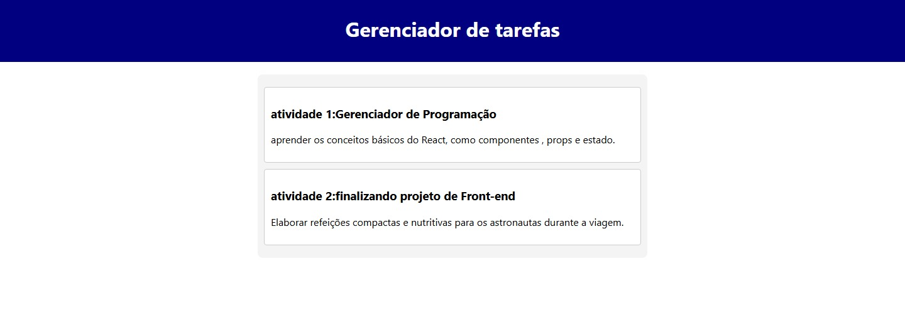

# Projeto Gerenciador de Tarefas com React

### **Data de Execução:** 04/12/2024  
### **Aluno:** Alysson Rodrigo  

---

## **Configuração do Projeto com React**

### **Passos Realizados**
**Aula 16 - Criando um Gerenciador de Tarefas com React**  

Nesta aula, realizei várias alterações no projeto para criar um gerenciador de tarefas utilizando React.  

### **Descrição das Alterações**
1. Criei o componente `Header`, que exibe o título "Gerenciador de Tarefas".  
2. Criei o componente `TaskContainer`, que exibe uma lista de tarefas fictícias com títulos e descrições.  
3. Modifiquei o arquivo `App.js` para importar e renderizar os componentes `Header` e `TaskContainer`.  
4. Utilizei CSS inline para estilizar os componentes diretamente dentro de cada arquivo, garantindo um layout simples e funcional.  


---

## **Detalhes dos Componentes**

### **Componente Header.js**
**Descrição:**  
O componente `Header` é responsável por exibir o título "Gerenciador de Tarefas" na parte superior da página. Ele serve como um cabeçalho fixo do aplicativo.  

**O que o componente faz?**  
- Renderiza o título "Gerenciador de Tarefas" no topo da página.  
- Aplica estilos para centralizar o texto e utiliza uma cor de fundo escura com texto branco para um visual limpo.  

**Como o estilo foi aplicado?**  
- Estilo aplicado diretamente no componente usando CSS inline.  

**Bloco de Código:**  

```javascript
//sds
```
import React from 'react';

function Header() {
return (
    <header style={headerStyle}>
    <h1>Gerenciador de tarefas</h1>
    </header>
);
}

const headerStyle = {
backgroundColor: '#000080',
color: 'white',
textAlign: 'center',
padding: '10px',
};

export default Header;
//sds

Componente TaskContainer.js
Descrição:
O componente TaskContainer é responsável por exibir as tarefas. Ele recebe uma lista de tarefas fictícias e as exibe com seus respectivos títulos e descrições.

O que o componente faz?

Renderiza uma lista de tarefas com título e descrição de cada uma.
Como as tarefas são exibidas?

Utiliza o método .map() para percorrer o array de tarefas e renderizar cada tarefa dinamicamente.
Como o layout foi estilizado?

CSS inline foi usado para estilizar margens, bordas e espaçamento.
Bloco de Código:
//sds
import React from 'react';

function TaskContainer() {
return (
    <div style={containerStyle}>
    <React.Fragment>
        <div style={taskStyle}>
        <h3>atividade 1:Gerenciador de Programação</h3>
        <p> aprender os conceitos básicos do React, como componentes , props e estado.</p>
        </div>
        <div style={taskStyle}>
        <h3>atividade 2:finalizando projeto de Front-end </h3>
        <p>Elaborar refeições compactas e nutritivas para os astronautas durante a viagem.</p>
        </div>
    </React.Fragment>
    </div>
);
}

// Estilos opcionais
const containerStyle = {
margin: '20px auto',
padding: '10px',
maxWidth: '600px',
backgroundColor: '#f4f4f4',
borderRadius: '8px',
};

const taskStyle = {
backgroundColor: '#fff',
padding: '10px',
margin: '10px 0',
border: '1px solid #ccc',
borderRadius: '4px',
};

export default TaskContainer;
//sds
---
Descrição:
O App.js é o ponto de entrada do aplicativo. Ele importa os componentes Header e TaskContainer e os renderiza na interface.

O que o arquivo App.js faz?

Organiza a renderização dos componentes Header e TaskContainer.
Bloco de Código:
//sds

import React from 'react';
import Header from './components/Header';
import TaskContainer from './components/TaskContainer';

function App() {
  return (
    <div>
      <Header />
      <TaskContainer />
    </div>
  );
}
export default App;
//sds
---
print site 



A estilização foi feita utilizando CSS inline, ou seja, os estilos foram aplicados diretamente dentro dos componentes React através da propriedade style.

Essa abordagem foi prática e rápida para o projeto, garantindo uma separação clara de estilos entre os componentes.
No entanto, para projetos maiores, pode ser necessário adotar outras estratégias, como:
Arquivos CSS externos.
Bibliotecas de estilização como Styled Components ou TailwindCSS.